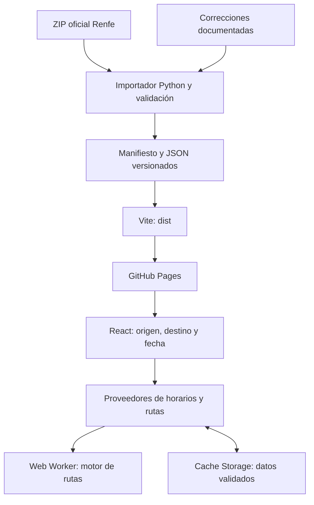

# Arquitectura y carpetas

La aplicación es una SPA estática. Python prepara los datos fuera del navegador; React consulta JSON y un Web Worker calcula las rutas. Solo la pasarela opcional de incidencias requiere ejecución en servidor.

## Mapa del repositorio

| Carpeta                                                 | Responsabilidad                                                                                                                                       |
| ------------------------------------------------------- | ----------------------------------------------------------------------------------------------------------------------------------------------------- |
| `src/app/`                                              | Composición de la pantalla, estado de selección y coordinación en `App.tsx`; prueba de integración React colocada junto al código.                    |
| `src/components/`                                       | Selectores, tabla, detalle de ruta, avisos, instalación, tema y onboarding. Algunos coordinan consultas; no son todos componentes puramente visuales. |
| `src/platform/`                                         | Preferencias y registro/activación del service worker. Dependencia explícita del navegador.                                                           |
| `src/data/`                                             | Tipos, calendarios, transformaciones, proveedores, validadores, catálogo, almacenamiento de datos y motor.                                            |
| `src/styles/`                                           | Estilos y temas; `app.css` mantiene el orden de la cascada.                                                                                           |
| `src/assets/`                                           | Recursos importados y versionados por Vite, como el icono del tren.                                                                                   |
| `build/`                                                | Plugin de versión de aplicación y plantilla del service worker. No es salida generada.                                                                |
| `scripts/`                                              | Importador/renovador GTFS, compilador del grafo, pruebas Python y herramientas locales.                                                               |
| `data/`                                                 | Configuración revisada de conexiones; es entrada del pipeline.                                                                                        |
| `public/`                                               | Archivos copiados a producción: datos versionados, iconos, manifiesto PWA y licencias.                                                                |
| `tests/`                                                | Pruebas de navegador y fixtures controlados. Unitarias junto a cada módulo de `src`.                                                                  |
| `worker/`                                               | Pasarela Cloudflare opcional para avisos de Renfe y sus pruebas.                                                                                      |
| `.github/workflows/`                                    | Validación, renovación y publicación.                                                                                                                 |
| `openspec/`                                             | Requisitos, cambios activos e historial de decisiones.                                                                                                |
| `docs/`                                                 | Este manual.                                                                                                                                          |
| `dist/`, `work/`, `test-results/`, `playwright-report/` | Salidas locales ignoradas por Git; no editar como fuente.                                                                                             |

`src/main.tsx` restaura el snapshot persistido, monta React y registra el service worker en producción.

## Dependencias

Dirección permitida: `app → components → platform → data`. Se puede saltar una capa hacia abajo. `data` no importa React ni componentes. `check:architecture` revisa imports y reexports estáticos con el parser TypeScript incluido en Prettier; los imports dinámicos y las dependencias indirectas requieren revisión humana. No hay índices que reexporten toda una carpeta.

Dentro de `data`, `router.ts` implementa el cálculo y `routing.ts` coordina descargas, caché y ejecución en `routing.worker.ts`. `graph-validation.ts` valida el contrato antes de almacenarlo. `renfe.ts` materializa horarios de estación. `snapshot.ts` adopta catálogo y archivo preparado conjuntamente. `offline-store.ts` encapsula Cache Storage. La separación entre dominio e infraestructura dentro de esta carpeta es todavía por módulos, no por subcarpetas.

## Recorrido de una consulta

1. App valida preferencias contra el catálogo y pide núcleo si falta uno válido.
2. Sin destino, se descarga el archivo de estación; calendarios y excepciones determinan el día civil consultado.
3. Con destino, se descarga el grafo del núcleo bajo demanda. Un worker busca hasta cuatro trenes y devuelve legs con horarios y cambios.
4. Cambiar la consulta cancela el trabajo anterior. La caché LRU de 24 consultas diarias incluye versión, núcleo, origen, destino, fecha y líneas.
5. Los componentes presentan salidas/llegadas y despliegan cada transbordo. No reconstruyen reglas ferroviarias.

La penalización de 15 minutos por cambio ordena alternativas con la misma salida; no se suma a la hora de llegada. Máximo de duración de búsqueda: 24 horas. Ver [contrato](data-contract.md).

## Dos ciclos de actualización

**Aplicación:** cada build crea `app-version.json` con identificador nuevo y `sw.js` con precaché de recursos. El usuario activa la actualización; no se recarga automáticamente una consulta en curso. Se conservan dos versiones del shell.

**Datos:** `current.json` apunta al manifiesto de un snapshot. El cliente valida la versión y adopta los datos coherentemente. Cache Storage conserva hasta doce archivos de datos de las dos últimas versiones consultadas, incluyendo grafos; no son doce redes completas. Los fallos o la falta de almacenamiento no impiden consultar online.

El grafo también se guarda en memoria durante la visita. Esa caché de grafos aún no tiene límite explícito; no confundirla con la LRU de resultados ni con Cache Storage.

El [pipeline cartográfico](map-pipeline.md) vive en `tools/maps/`, usa fuentes/anotaciones de `data/maps/` y genera artefactos en `work/`. Su propuesta se promueve al contrato de `routing-corrections.json`; el router no lee PDF/SVG ni anotaciones gráficas.
